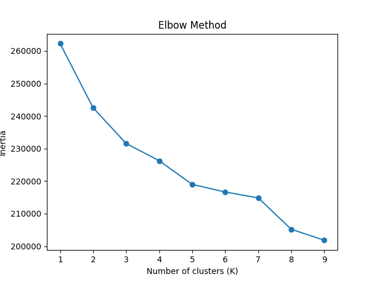
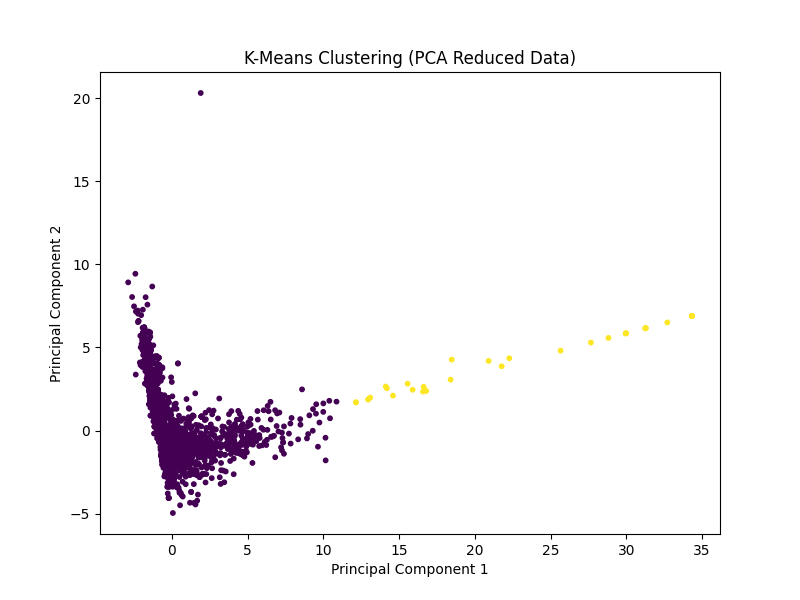
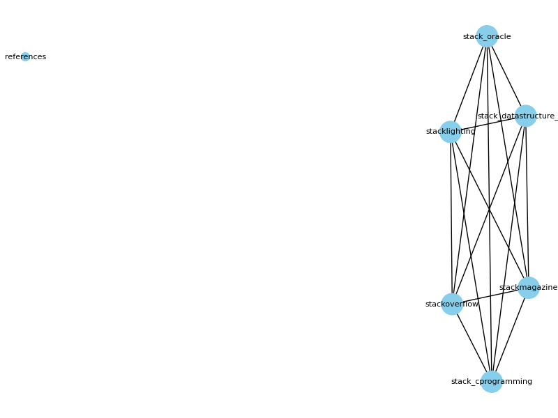

# 🚀 Machine Learning Assignment 4

This repository contains the complete implementation of Assignment 4.

The assignment covers three main tasks:
- Q1: Clustering using Spam Dataset
- Q2: Search Engine using Inverted Index
- Q3: PageRank using PySpark

---

# 📁 Project Structure

ml_assignment4/

- q1_spam_clustering.py  
- q2_search_engine.py  
- q3_pagerank.py  
- elbow.png  
- clusters.png  
- pagerank_graph.png  
- README.md  

---

# 📊 Q1: Clustering (Spam Dataset)

## Objective
The goal is to group emails into spam and non-spam categories using clustering techniques.

## Approach
- First, the dataset is loaded and features are separated.
- Data is normalized using StandardScaler.
- PCA is applied to reduce data into 2 dimensions for visualization.
- Clustering is performed using:
  - K-Means
  - K-Means++
  - k-center (Farthest First)
- Elbow Method is used to choose the best value of K.

## Graphs

### Elbow Method

### Cluster Visualization

## Output

student@DESKTOP-VSHBHG5:~/ml_assignment4$ python q1_spam_clustering.py

Loading dataset...
Dataset shape: (4601, 58)

Applying PCA (Dimensionality Reduction)...
PCA complete!

Applying K-Means clustering...
Clustering complete!

Evaluating clustering...
Accuracy (best): 0.5985

Confusion Matrix:
[[2754   34]
 [1813    0]]

Execution completed successfully

## Observation
The clustering gives around 59% accuracy. Since clustering is an unsupervised method, perfect accuracy is not expected.

---

# 🔍 Q2: Search Engine (Inverted Index)

## Objective
The goal is to build a simple search engine using inverted index.

## Approach
- All webpages are read from dataset.
- Text is cleaned (lowercase, remove punctuation, remove stop words).
- An inverted index is created:
  word → (page, position)
- Queries from actions.txt are processed.

## Output

student@DESKTOP-VSHBHG5:~/ml_assignment4$ python q2_search_engine.py

Initializing Search Engine...
Total words indexed: 380

===== PROCESSING actions.txt =====

Query: Pages containing 'stack'
stackoverflow, stack_oracle, stack_datastructure_wiki, stack_cprogramming

Query: Pages containing 'delhi'
No webpage contains word delhi

Query: Pages containing 'wikipedia'
references, stack_datastructure_wiki

Execution completed successfully

## Observation
The search engine correctly finds pages for given words and handles missing words properly.

---

# 🌐 Q3: PageRank (PySpark)

## Objective
The goal is to compute importance of nodes using PageRank algorithm.

## Approach
- Graph is created from input data.
- PageRank algorithm is applied using PySpark.
- Iterations are performed until convergence.

## Graph

## Output

student@DESKTOP-VSHBHG5:~/ml_assignment4$ python q3_pagerank.py

Starting Spark PageRank...
Graph loaded successfully!

Running PageRank iterations...
PageRank iterations completed!

Top 5 nodes:
263: 0.002020
537: 0.001943
965: 0.001925
243: 0.001853
285: 0.001827

Bottom 5 nodes:
408: 0.000388
424: 0.000355
62: 0.000353
93: 0.000351
558: 0.000329

Step Q3 completed
student@DESKTOP-VSHBHG5:~/ml_assignment4$

## Observation
Nodes with higher PageRank values are more important in the graph.

---

# ⚙️ How to Run

Run each file using:

python q1_spam_clustering.py  
python q2_search_engine.py  
python q3_pagerank.py  

---

# 📦 Requirements

Install required libraries:

pip install numpy pandas scikit-learn matplotlib networkx pyspark  

---

# 🎯 Conclusion

This assignment successfully demonstrates:
- Clustering techniques using K-Means and PCA
- Search engine using inverted index
- Graph ranking using PageRank

All tasks are completed with proper outputs and visualizations.

---

# 👨‍💻 Author

Shantanu Rao
